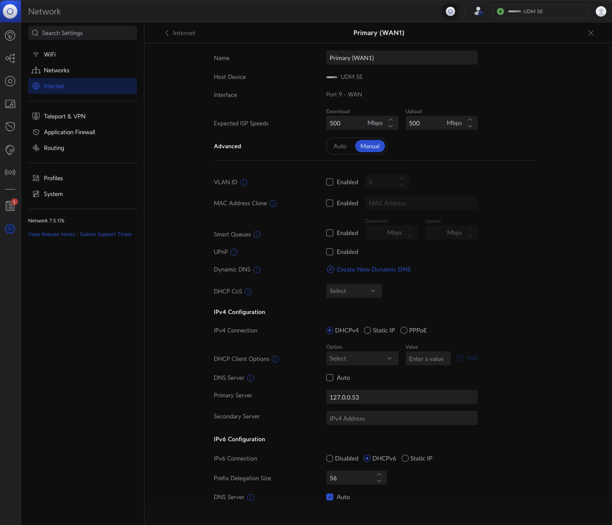

# cloudflared

## Features

1. cloudflared tunneling service, aka. Argo Tunnels / Zero Trust / etc
2. cloudflared proxy-dns service, provides DNS-over-HTTPS capability for all DNS traffic out from your UDM-SE

## Requirements

1. You have successfully setup the on boot script described [here](https://github.com/unifi-utilities/unifios-utilities/tree/main/on-boot-script)

## Configuration

### cloudflared tunnel

Configuration is required here, otherwise nothing will work.

You need to modify `SERVICE_TOKEN` in `51-cloudflared-tunnel.sh` with the secret token you got when configuring the tunnel in Cloudflare Zero Trust

Run the script and ensure it doesn't error,

```bash
root@UDM-SE:/mnt/data/on_boot.d# ./51-cloudflared-tunnel 
Hit:1 https://deb.debian.org/debian bullseye InRelease
Hit:2 https://download.docker.com/linux/debian bullseye InRelease                                                              
Hit:3 https://deb.debian.org/debian bullseye-updates InRelease                                                                                           
Hit:4 https://pkg.cloudflare.com/cloudflared bullseye InRelease                                                                                        
Hit:5 https://security.debian.org/debian-security bullseye-security InRelease                                           
Hit:6 https://deb.debian.org/debian bullseye-backports InRelease                                  
Hit:7 https://apt.artifacts.ui.com bullseye InRelease                       
Reading package lists... Done
Building dependency tree... Done
Reading state information... Done
All packages are up to date.
Reading package lists... Done
Building dependency tree... Done
Reading state information... Done
cloudflared is already the newest version (2023.8.2).
Calculating upgrade... Done
The following packages were automatically installed and are no longer required:
  libltdl7 libslirp0 slirp4netns
Use 'apt autoremove' to remove them.
0 upgraded, 0 newly installed, 0 to remove and 0 not upgraded.
root@UDM-SE:/mnt/data/on_boot.d#
```

Now check that the services are healthy,

```bash
root@UDM-SE:~# systemctl status cloudflared.service
● cloudflared.service - cloudflared
     Loaded: loaded (/etc/systemd/system/cloudflared.service; enabled; vendor preset: enabled)
     Active: active (running) since Wed 2023-10-04 15:59:16 AEST; 2h 51min ago
   Main PID: 6060 (cloudflared)
      Tasks: 9 (limit: 4724)
     Memory: 19.8M
        CPU: 21.886s
     CGroup: /system.slice/cloudflared.service
             └─6060 /usr/bin/cloudflared --no-autoupdate tunnel run --token REMOVED

Oct 04 15:59:16 UDM-SE cloudflared[6060]: 2023-10-04T05:59:16Z INF ICMP proxy will use fe80::d221:f9ff:fe89:c24b in zone eth8 as source for IPv6
Oct 04 15:59:16 UDM-SE cloudflared[6060]: 2023-10-04T05:59:16Z WRN The user running cloudflared process has a GID (group ID) that is not within ping_group_range. You might need to add that user to a group within that range, or instead update the range to encompass a group the user is already in by modifying /proc/sys/net/ipv4/ping_group_r>
Oct 04 15:59:16 UDM-SE cloudflared[6060]: 2023-10-04T05:59:16Z WRN ICMP proxy feature is disabled error="cannot create ICMPv4 proxy: Group ID 0 is not between ping group 1 to 0 nor ICMPv6 proxy: socket: permission denied"
Oct 04 15:59:16 UDM-SE cloudflared[6060]: 2023-10-04T05:59:16Z INF Starting metrics server on 127.0.0.1:38587/metrics
Oct 04 15:59:16 UDM-SE cloudflared[6060]: 2023-10-04T05:59:16Z INF Registered tunnel connection connIndex=0 connection=REMOVED event=0 ip=198.41.200.33 location=syd04 protocol=quic
Oct 04 15:59:16 UDM-SE systemd[1]: Started cloudflared.
Oct 04 15:59:17 UDM-SE cloudflared[6060]: 2023-10-04T05:59:17Z INF Registered tunnel connection connIndex=1 connection=REMOVED event=0 ip=198.41.192.167 location=bne01 protocol=quic
Oct 04 15:59:18 UDM-SE cloudflared[6060]: 2023-10-04T05:59:18Z INF Updated to new configuration config=null version=0
Oct 04 15:59:18 UDM-SE cloudflared[6060]: 2023-10-04T05:59:18Z INF Registered tunnel connection connIndex=2 connection=REMOVED event=0 ip=198.41.200.23 location=syd07 protocol=quic
Oct 04 15:59:19 UDM-SE cloudflared[6060]: 2023-10-04T05:59:19Z INF Registered tunnel connection connIndex=3 connection=REMOVED event=0 ip=198.41.192.67 location=bne01 protocol=quic
root@UDM-SE:~# 
```

### cloudflared proxy-dns

Modify the variables in `50-cloudflared-proxy-dns.sh`, the defaults are:

```bash
BIND=127.0.0.53
PORT=53
UPSTREAM="https://1.1.1.1/dns-query https://1.0.0.1/dns-query"
BOOTSTRAP="https://162.159.36.1/dns-query https://162.159.46.1/dns-query https://[2606:4700:4700::1111]/dns-query https://[2606:4700:4700::1001]/dns-query"
ARGS="--metrics ${BIND}: --address ${BIND} --port ${PORT}"
```

No configuration is strictly necessary as the above will work and punch DNS requests out thru the default Cloudflare 1.1.1.1/1.0.0.1 resolvers, only over HTTPS.

You may want to change `UPSTREAM=` if you want to use a different DNS-over-HTTPS resolver.

For example if you are using Cloudflare Zero Trust Gateway services, there will be a location specific hostname for DNS-over-HTTPS, so you would:

Change the default variable value of `UPSTREAM="https://1.1.1.1/dns-query https://1.0.0.1/dns-query"` 

To `UPSTREAM="https://UNIQUE_HOSTNAME_FOR_LOCATION.cloudflare-gateway.com/dns-query"`

Run the script,

```bash
root@UDM-SE:/mnt/data/on_boot.d# ./50-cloudflared-proxy-dns 
Hit:1 https://deb.debian.org/debian bullseye InRelease
Hit:2 https://deb.debian.org/debian bullseye-updates InRelease                                                                                                                             
Hit:3 https://deb.debian.org/debian bullseye-backports InRelease                                                                                                                           
Hit:4 https://download.docker.com/linux/debian bullseye InRelease                                                                                                                          
Get:5 https://security.debian.org/debian-security bullseye-security InRelease [48.4 kB]                                                                              
Hit:6 https://pkg.cloudflare.com/cloudflared bullseye InRelease                                          
Hit:7 https://apt.artifacts.ui.com bullseye InRelease                                                    
Fetched 48.4 kB in 1s (35.4 kB/s)
Reading package lists... Done
Building dependency tree... Done
Reading state information... Done
All packages are up to date.
Reading package lists... Done
Building dependency tree... Done
Reading state information... Done
cloudflared is already the newest version (2023.8.2).
Calculating upgrade... Done
The following packages were automatically installed and are no longer required:
  libltdl7 libslirp0 slirp4netns
Use 'apt autoremove' to remove them.
0 upgraded, 0 newly installed, 0 to remove and 0 not upgraded.
Removed /etc/systemd/system/multi-user.target.wants/cloudflared-proxy-dns.service.
removed '/etc/systemd/system/cloudflared-proxy-dns.service'
Created symlink /etc/systemd/system/multi-user.target.wants/cloudflared-proxy-dns.service → /etc/systemd/system/cloudflared-proxy-dns.service.
root@UDM-SE:/mnt/data/on_boot.d# 
```

Now check the status,

```bash
root@UDM-SE:~# systemctl status cloudflared-proxy-dns.service
● cloudflared-proxy-dns.service - DNS over HTTPS (DoH) proxy client
     Loaded: loaded (/etc/systemd/system/cloudflared-proxy-dns.service; enabled; vendor preset: enabled)
     Active: active (running) since Wed 2023-10-04 15:59:07 AEST; 2h 52min ago
   Main PID: 4894 (cloudflared)
      Tasks: 9 (limit: 4724)
     Memory: 20.0M
        CPU: 5.701s
     CGroup: /system.slice/cloudflared-proxy-dns.service
             └─4894 /usr/bin/cloudflared proxy-dns --metrics 127.0.0.53: --address 127.0.0.53 --port 53 --upstream https://REMOVED.cloudflare-gateway.com/dns-query --bootstrap https://162.159.36.1/dns-query --bootstrap https://162.159.46.1/dns-query --bootstrap https://[2606:4700:4700::1111]/dns-query --bootstrap https://[2606:4700:470>

Oct 04 15:59:07 UDM-SE systemd[1]: Started DNS over HTTPS (DoH) proxy client.
Oct 04 15:59:11 UDM-SE cloudflared[4894]: 2023-10-04T05:59:11Z INF Adding DNS upstream url=https://REMOVED.cloudflare-gateway.com/dns-query
Oct 04 15:59:11 UDM-SE cloudflared[4894]: 2023-10-04T05:59:11Z INF Starting metrics server on 127.0.0.53:41219/metrics
Oct 04 15:59:11 UDM-SE cloudflared[4894]: 2023-10-04T05:59:11Z INF Starting DNS over HTTPS proxy server address=dns://127.0.0.53:53
root@UDM-SE:~# 
```

You should also understand what's been done to capture all outbound DNS traffic from both your LAN and your UDM-SE

A dummy interface named "cloudflared" has been created with an IP of 127.0.0.53/32.

```bash
root@UDM-SE:~# ip addr show dev cloudflared
34: cloudflared: <BROADCAST,NOARP> mtu 1500 qdisc noop state DOWN group default qlen 1000
    link/ether b6:0f:bb:8e:2e:53 brd ff:ff:ff:ff:ff:ff
    inet 127.0.0.53/32 scope host cloudflared
       valid_lft forever preferred_lft forever
root@UDM-SE:~# 

root@UDM-SE:~# netstat -tuapn | grep :53 | grep cloudflared
tcp        0      0 127.0.0.53:53           0.0.0.0:*               LISTEN      4894/cloudflared    
udp        0      0 127.0.0.53:53           0.0.0.0:*                           4894/cloudflared    
root@UDM-SE:~# 
```

And that's it at a basic level. dnsmasq has not been modified in any way and the dnsmasq process is still listening on 127.0.0.1:53 (and various other interfaces) which the UDM-SE itself is using as a resolver.

e.g.

```bash
root@UDM-SE:~# cat /etc/resolv.conf 
# Generated automatically by ubios-udapi-server
nameserver 127.0.0.1
root@UDM-SE:~#
```

So your final step, in order to ensure ALL of your local network DNS traffic flows through `cloudflared proxy-dns`, is to reconfigure your upstream Internet connectivity interfaces to use 127.0.0.53

e.g. in the Unifi UI reconfigure things similar to the below,



NOTE: If you have multiple WAN connections, update ALL of them to use 127.0.0.53 as the DNS server for the connection.

This will result in the following being configured in files on your UDM-SE,

```bash
root@UDM-SE:~# cat /etc/resolv.conf 
# Generated automatically by ubios-udapi-server
nameserver 127.0.0.1
root@UDM-SE:~# cat /etc/resolv.dnsmasq 
# Generated automatically by ubios-udapi-server
# static nameservers
# eth8
nameserver 127.0.0.53
root@UDM-SE:~# cat /run/dns.conf.d/resolv.
resolv.eth10  resolv.eth7   resolv.eth8   resolv.ppp1   
root@UDM-SE:~# cat /run/dns.conf.d/resolv.*
# Generated automatically by ubios-udapi-server
# Generated automatically by ubios-udapi-server
# Generated automatically by ubios-udapi-server
# static nameservers
nameserver 127.0.0.53
# Generated automatically by ubios-udapi-server
root@UDM-SE:~# 
```

What this means is that:

1. The UnifOS itself resolves via 127.0.0.1:53, which is dnsmasq
2. dnsmasq resolves via 127.0.0.53, which is cloudflared, any time the DNS request has to go out to the Internet, *regardless* of which WAN connection will be used, it will route through cloudflared.
3. Systems in your networks resolve via UDM-SE IP, which means the dnsmasq process, and then dnsmasq resolves their requests via 127.0.0.1:53, which is cloudflared

Because of #1 all of your internal DNS aliases/hostnames for your connected devices will continue to work.

cloudflared will use your active Internet connection to reach the configured resolvers. Note however, that the bootstrap resolvers, which are identified by IP, *MUST* be reachable first.

`BOOTSTRAP="https://162.159.36.1/dns-query https://162.159.46.1/dns-query https://[2606:4700:4700::1111]/dns-query https://[2606:4700:4700::1001]/dns-query"`

If all of the above bootstrap resolver IP's are NOT accessible, for example because you have created firewall rules or done anything else to stop connectivity to them working, DNS resolution will probably stop working too.

