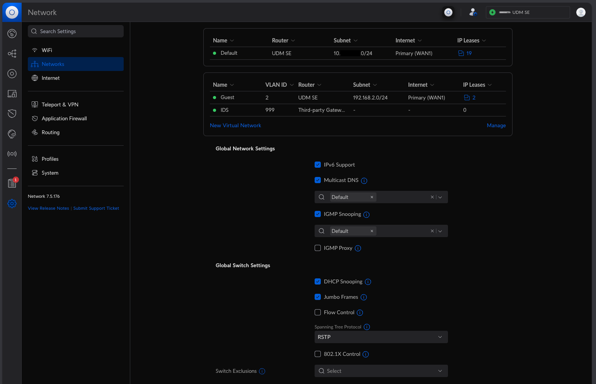
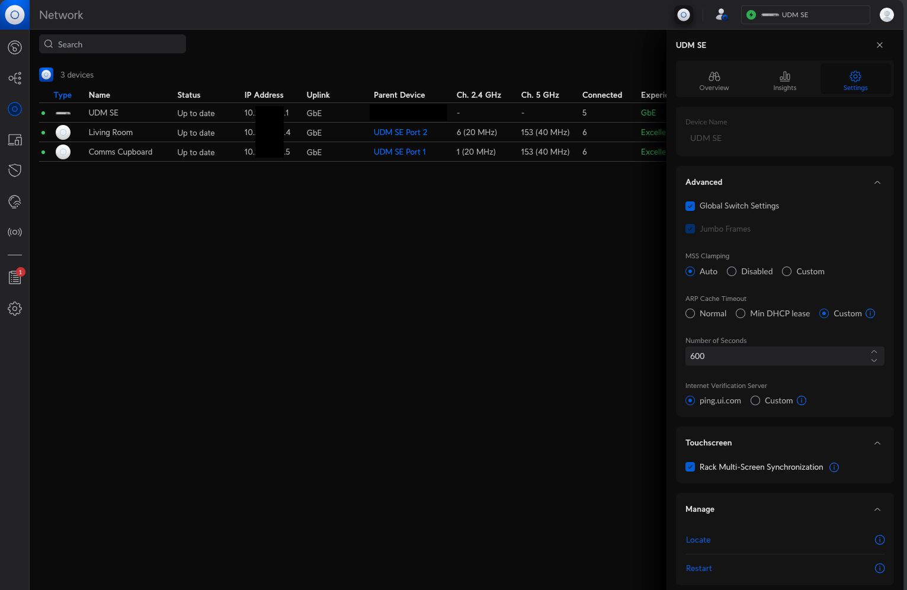
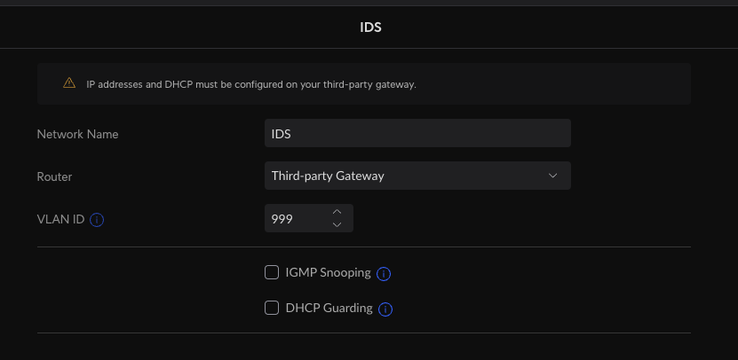
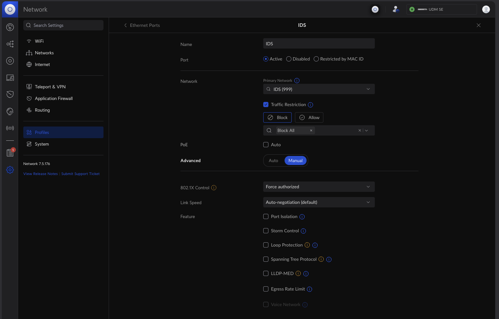
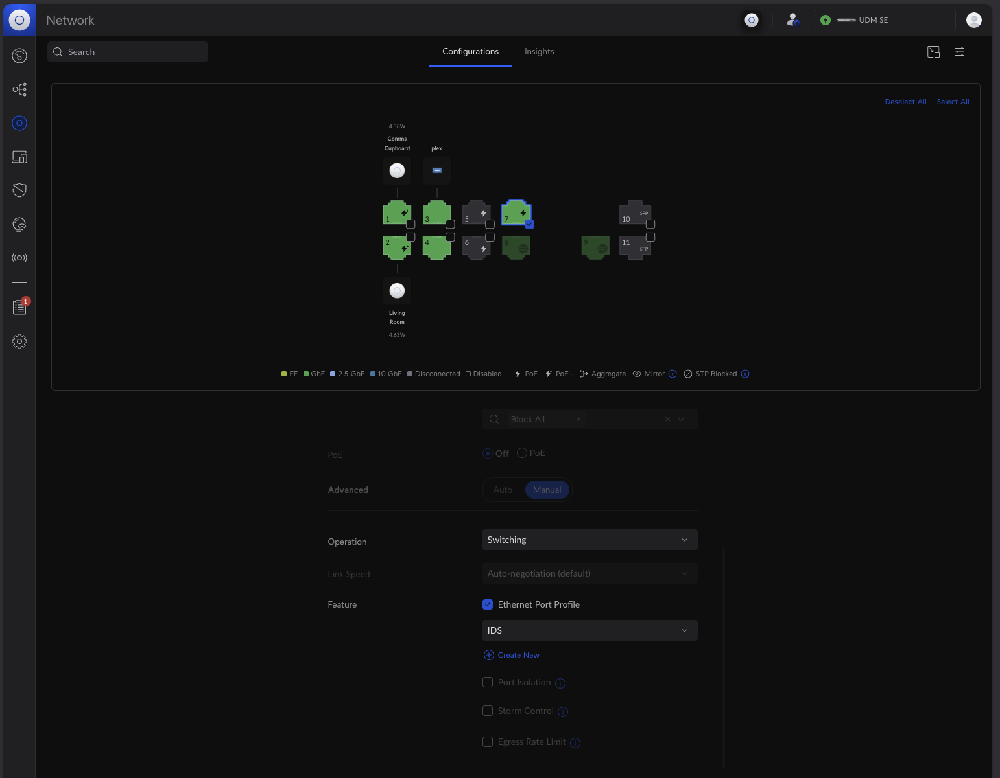
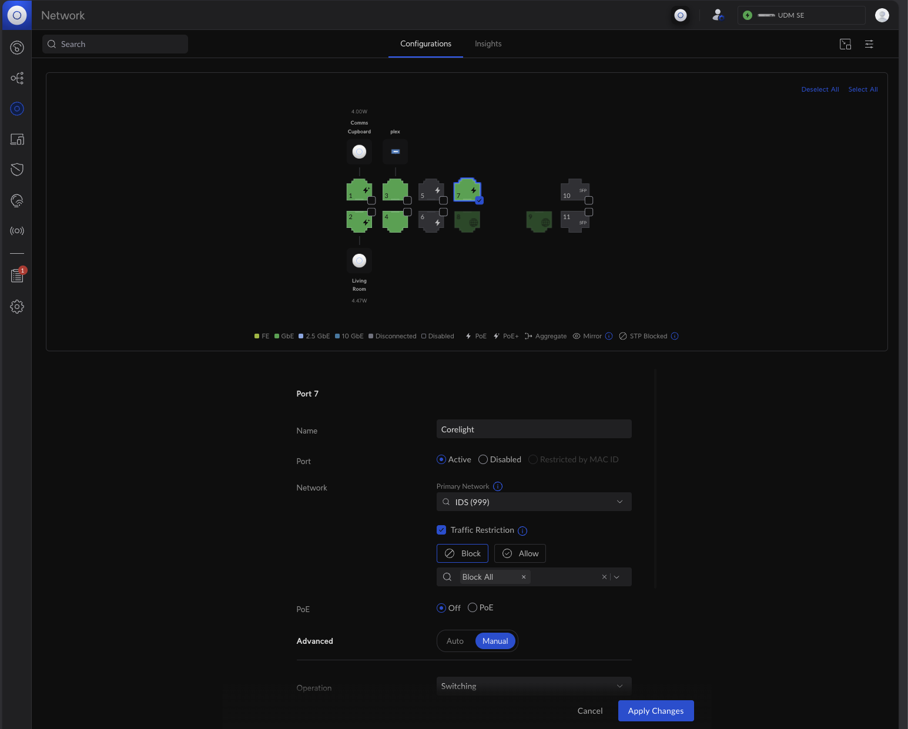

# Traffic Mirroring

This documentation and the on_boot.d script has been built and tested on a Unifi Dream Machine Special Edition/UDM-SE.

If you have another model the switchN and interface numbers may be different, though you'll likely have full traffic monitoring features in the Unifi UI.

For some reason Ubiquiti hasn't made this available on UDM-SE properly and you only mirror from one physical interface to one other physical interface. e.g. VLAN based traffic mirroring is not an option.

## Prerequisites

Finish setup of [on_boot.d](../on-boot-script/)

### Configure Jumbo Frames

Just will likely need to ensure Ethernet Jumbo Frames are enabled in order to ensure VLAN-in-VLAN tagged Ethernet frames with a full 1500 byte payloard, or  can be output to your target switch port.

NOTE: I've not really validated that is 100% necessary, but it's a common problem in NIDS scenarios, so I've simply enabled it.





### Determine which VLAN's you want to mirror

Typically on UDM-SE this will mean you want `switch0.1` at minimum for the default network, and if you have a guest network enabled possibly `switch0.2` as well.

If you have additional VLAN's, or different VLAN's to monitor you need to identify them to a switch sub-interface, e.g. typically it'll just be `switch0.%{VLAN_ID}`

### Determine which destination port you will use

This will typically be an `ethN` port with numbering off by one, because Ubiquiti.

e.g. so port 7 that you see in the Unifi UI is actually `eth6` under the hood.

You just simply need to identify a free physical port by number and connect your destination device to it, and know that the `N` numbered port you connected to is actually `ethN-1`

### Configure the traffic-mirroring script variables

You need to configure SOURCE_INTERFACES as identified above, and IDS_PORT as identified above, in the `98-traffic-mirror.sh` script

Example,

```bash
SOURCE_INTERFACES="switch0.1 switch0.2"
IDS_PORT="eth6"
```

### Create an IDS/traffic mirroring only VLAN

This is entirely optional, but highly recommended, as it will ensure your traffic mirroring destination does not see duplicate traffic.

e.g. use VLAN#999 and name it "IDS"



### Create an IDS/traffic mirroring port profile

1. Primary network == "IDS" if created in prior step
2. Traffic restriction == "Block"/"Block All"
3. PoE == disabled/off/unticked (unless your destination device is actually powered by PoE!)
4. All Feature options == disabled/off/unticked



### Configure your destination port with the port profile

1. The port "Operation" must still be "Switching" even if you find that "Mirroring" is an option.
1. Apply the Ethernet Port Profile as previously configured, e.g. select "IDS" from the drop down menu



Alternatively manually configure the port similar to the below,



## Run the script manually to ensure it does what you want

NOTE: You can optionally run `export TEST_ONLY=1` before running the script, in order to see what it will do and validate that it will run without error, without modifying any configuration.

NOTE: You can run `export VERBOSE=` to get see additional output, e.g. the output from the tc commands which shows how queues and filters have been configured.

Run the script to start the container.

```bash
root@UDM-SE:/mnt/data/on_boot.d# export VERBOSE=1
root@UDM-SE:/mnt/data/on_boot.d# ./98-traffic-mirror
Mirroring traffic from switch0.1 to eth6
Creating Traffic Control queue for switch0.1...OK

Current Traffic Control queue for switch0.1...

qdisc noqueue 0: root refcnt 2 
 Sent 0 bytes 0 pkt (dropped 0, overlimits 0 requeues 0) 
 backlog 0b 0p requeues 0
qdisc ingress ffff: parent ffff:fff1 ---------------- 
 Sent 0 bytes 0 pkt (dropped 0, overlimits 0 requeues 0) 
 backlog 0b 0p requeues 0

Creating Traffic Control filter for switch0.1 mirroring to eth6...OK

Current Traffic Control filter for switch0.1...

filter protocol all pref 49152 u32 chain 0 
filter protocol all pref 49152 u32 chain 0 fh 800: ht divisor 1 
filter protocol all pref 49152 u32 chain 0 fh 800::800 order 2048 key ht 800 bkt 0 terminal flowid ??? not_in_hw  (rule hit 2 success 2)
  match 00000000/00000000 at 0 (success 2 ) 
        action order 1: mirred (Egress Mirror to device eth6) pipe
        index 1 ref 1 bind 1
        Action statistics:
        Sent 104 bytes 2 pkt (dropped 0, overlimits 0 requeues 0) 
        backlog 0b 0p requeues 0


Mirroring traffic from switch0.2 to eth6
Creating Traffic Control queue for switch0.2...OK

Current Traffic Control queue for switch0.2...

qdisc noqueue 0: root refcnt 2 
 Sent 0 bytes 0 pkt (dropped 0, overlimits 0 requeues 0) 
 backlog 0b 0p requeues 0
qdisc ingress ffff: parent ffff:fff1 ---------------- 
 Sent 0 bytes 0 pkt (dropped 0, overlimits 0 requeues 0) 
 backlog 0b 0p requeues 0

Creating Traffic Control filter for switch0.2 mirroring to eth6...OK

Current Traffic Control filter for switch0.2...

filter protocol all pref 49152 u32 chain 0 
filter protocol all pref 49152 u32 chain 0 fh 800: ht divisor 1 
filter protocol all pref 49152 u32 chain 0 fh 800::800 order 2048 key ht 800 bkt 0 terminal flowid ??? not_in_hw  (rule hit 0 success 0)
  match 00000000/00000000 at 0 (success 0 ) 
        action order 1: mirred (Egress Mirror to device eth6) pipe
        index 2 ref 1 bind 1
        Action statistics:
        Sent 0 bytes 0 pkt (dropped 0, overlimits 0 requeues 0) 
        backlog 0b 0p requeues 0


root@UDM-SE:/mnt/data/on_boot.d#
```

It should run automatically now, if you've configured unifos-utilities on_boot.d correctly.

